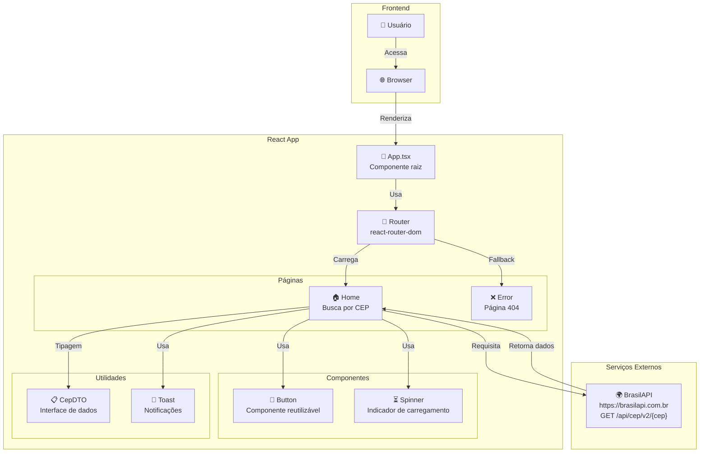
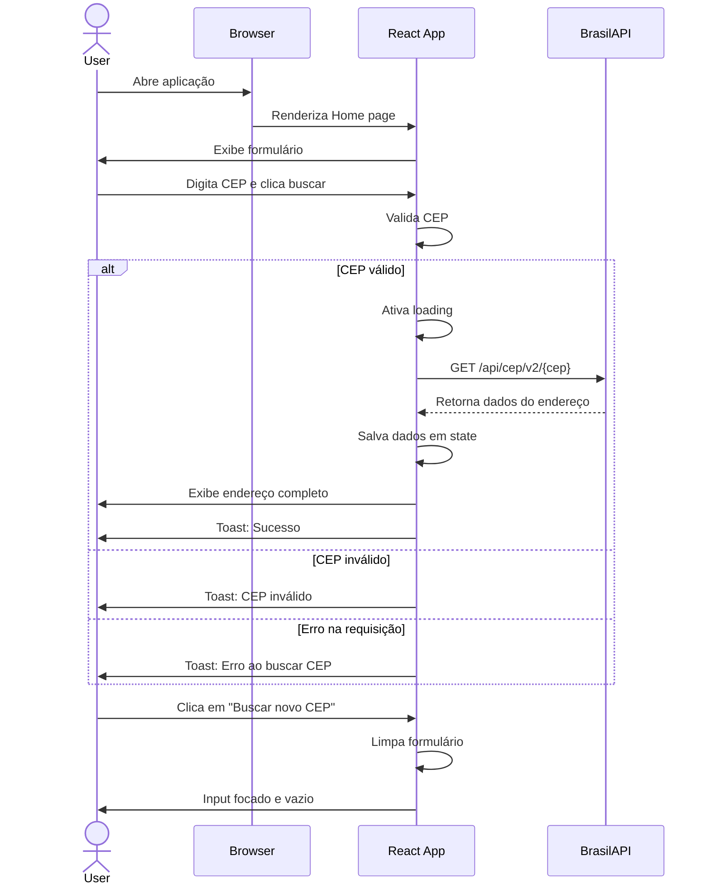

# React CEP - Buscar Endereços por CEP

Uma aplicação React moderna para buscar informações de endereços brasileiros através do código postal (CEP), utilizando a API BrasilAPI.

## 📋 Índice

- [Visão Geral](#visão-geral)
- [Tecnologias](#tecnologias)
- [Arquitetura](#arquitetura)
- [Começando](#começando)
  - [Pré-requisitos](#pré-requisitos)
  - [Instalação](#instalação)
  - [Executando](#executando)
- [Estrutura do Projeto](#estrutura-do-projeto)
- [Funcionalidades](#funcionalidades)
- [Componentes](#componentes)

---

## Visão Geral

A aplicação React CEP permite que usuários busquem informações detalhadas sobre endereços brasileiros inserindo um código postal (CEP). A aplicação consome dados da API pública **BrasilAPI**, oferecendo uma experiência de usuário intuitiva e responsiva com notificações em tempo real.

## Tecnologias

- **React** (v18.2.0) - Biblioteca para construção de interfaces
- **TypeScript** - Tipagem estática para JavaScript
- **Vite** - Build tool rápido e moderno
- **React Router DOM** (v6.19.0) - Roteamento de páginas
- **Tailwind CSS** - Utility-first CSS framework
- **React Hot Toast** (v2.5.2) - Notificações elegantes
- **PostCSS & Autoprefixer** - Processamento de CSS
- **Netlify CLI** - Deploy e hospedagem

---

## Arquitetura

A aplicação segue uma arquitetura modular com separação clara entre componentes, páginas e utilitários:



---

## Começando

### Pré-requisitos

- Node.js (v16 ou superior)
- npm ou yarn

### Instalação

```bash
# Clonar o repositório (se necessário)
cd react_cep

# Instalar dependências
npm install
```

### Executando

```bash
# Modo desenvolvimento
npm run dev

# Build para produção
npm run build

# Preview da build
npm run preview

# Lint do código
npm run lint
```

---

## Estrutura do Projeto

```
react_cep/
├── src/
│   ├── App.tsx                 # Componente raiz da aplicação
│   ├── main.tsx                # Ponto de entrada
│   ├── vite-env.d.ts           # Tipagens do Vite
│   ├── routes/
│   │   └── main.routes.tsx     # Configuração de rotas
│   ├── styles/
│   │   └── index.css           # Estilos globais + Tailwind
│   └── ui/
│       ├── components/
│       │   ├── Button.tsx      # Componente reutilizável de botão
│       │   └── Spinner.tsx     # Indicador de carregamento
│       └── pages/
│           ├── Error/
│           │   └── index.tsx   # Página de erro 404
│           └── Home/
│               ├── index.tsx   # Página principal de busca
│               └── cep-dtos.ts # Interfaces de dados
├── public/                      # Assets estáticos
├── index.html                   # Arquivo HTML principal
├── package.json                # Dependências e scripts
├── tsconfig.json               # Configuração TypeScript
├── vite.config.ts              # Configuração Vite
├── tailwind.config.js          # Configuração Tailwind CSS
└── postcss.config.js           # Configuração PostCSS
```

---

## Funcionalidades

✅ **Busca por CEP** - Insira um CEP válido e obtenha informações do endereço
✅ **Validação de Entrada** - Validação em tempo real do CEP
✅ **Notificações** - Feedback visual com toast notifications
✅ **Indicador de Carregamento** - Spinner durante requisições
✅ **Tratamento de Erros** - Mensagens de erro claras e amigáveis
✅ **Design Responsivo** - Layout adaptável para diferentes telas
✅ **Roteamento** - Navegação entre páginas com React Router

---

## Componentes

### Button.tsx

Componente reutilizável de botão com estilos personalizados e estados.

### Spinner.tsx

Componente de loading indicador para exibir durante requisições assíncronas.

### Home (pages/Home/index.tsx)

Página principal que implementa:

- Input para CEP
- Chamada à BrasilAPI
- Exibição de resultados
- Tratamento de erros com toast
- Reset do formulário

### Error (pages/Error/index.tsx)

Página de erro para rotas não encontradas (404).

---

## Fluxo de Dados



---

## API Integrada

### BrasilAPI - CEP

**Endpoint:** `GET https://brasilapi.com.br/api/cep/v2/{cep}`

**Parâmetros:**

- `cep` (string) - Código postal brasileiro (5 dígitos)

**Resposta de Sucesso:**

```json
{
  "cep": "01310100",
  "state": "SP",
  "city": "São Paulo",
  "neighborhood": "Centro",
  "street": "Avenida Paulista"
}
```

**Resposta de Erro:**

```json
{
  "name": "CepPromiseError",
  "message": "CEP NAO ENCONTRADO",
  "status": 404
}
```

---

## Notas de Desenvolvimento

- A aplicação utiliza **Vite** para desenvolvimento rápido com HMR (Hot Module Replacement)
- **Tailwind CSS** é configurado para utilitários de estilo
- **React Router** maneja navegação com fallback para página de erro
- **TypeScript** garante type-safety em toda a aplicação
- **React Hot Toast** fornece notificações não-intrusivas

---

**Desenvolvido por Júlio Henrique**
